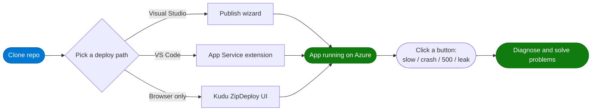

# AppServiceScenarios — Hands-on Lab

A small ASP.NET Web Forms app that **intentionally misbehaves** (slow, crash, 500, leak) so you can practice Azure App Service diagnostics in a safe environment.

[](https://learn.microsoft.com/aspnet/overview)
[](https://learn.microsoft.com/azure/app-service/)
[](#license)

**Live demo:** <https://appservicescenarios.azurewebsites.net/>

### Lab at a glance



---

## The scenarios

| Page | What it does | Use it to demo |
|---|---|---|
| `/FastResponse.aspx` | Returns in < 50 ms | A healthy baseline |
| `/Slow10.aspx` | Sleeps 10 s | Slow-request detector |
| `/Slow60.aspx` | Sleeps 60 s | Request timeouts (default 230 s) |
| `/Http500.aspx` | Always 500 | Clean Auto Heal trigger |
| `/NullRef.aspx` | Unhandled `NullReferenceException` | 500 + stack trace |
| `/StackOverflow.aspx?go=1` | Infinite recursion → w3wp crash | Crash dumps |
| `/HealthCheck.aspx` | 200 by default, `?fail=1` → 500 | Health Check feature |

---

## Deploy it — pick one of 3 ways

### Option 1 — Visual Studio 2022 (Publish wizard)

<p align="center">
  <br/>
  <em>Right-click the project → <strong>Publish</strong>. Image © Microsoft Learn (CC-BY 4.0).</em>
</p>

1. Open `AppServiceScenarios.sln` in Visual Studio 2022.
2. Right-click the project → **Publish** → **Azure** → **Azure App Service (Windows)**.
3. Sign in, pick a subscription, click **+ Create new** (or pick an existing App Service) → **Finish** → **Publish**.

Full walkthrough: <https://learn.microsoft.com/azure/app-service/quickstart-dotnetcore>

### Option 2 — VS Code (Azure App Service extension)

1. Install the [**Azure App Service**](https://marketplace.visualstudio.com/items?itemName=ms-azuretools.vscode-azureappservice) extension.
2. Sign in: command palette → **Azure: Sign In**.
3. Right-click the workspace folder → **Deploy to Web App…** → pick or create an App Service → confirm.

Full walkthrough: <https://learn.microsoft.com/azure/app-service/quickstart-dotnet?tabs=netframework48&pivots=development-environment-vscode>

### Option 3 — Browser only (Kudu ZipDeploy UI)

No Visual Studio, no CLI. Just a browser.

1. **Download** the prebuilt artifact: [**deploy.zip**](https://github.com/manju6685/AppServiceScenarios/releases/download/v1.0.0/deploy.zip) (8.25 MB)
2. Open `https://<your-app-name>.scm.azurewebsites.net/ZipDeployUI` in your browser.
3. **Drag** `deploy.zip` onto the drop zone. Wait for *Deployment successful*.

> Requires basic auth enabled on SCM **or** Entra ID account with the `Website Contributor` role.

---

## After it's deployed

Browse to `https://<your-app-name>.azurewebsites.net/` and click any scenario button. Then open the App Service in the Portal → **Diagnose and solve problems**:

<p align="center">
  <br/>
  <em>Image © Microsoft Learn (CC-BY 4.0).</em>
</p>

Useful detectors to try: **Web App Down**, **Web App Slow**, **High CPU**, **Application Crashes**.

---

## Run locally

```powershell
git clone https://github.com/manju6685/AppServiceScenarios.git
cd AppServiceScenarios
# Open AppServiceScenarios.sln in Visual Studio 2022 → press F5
```

The app runs on `https://localhost:44300/`.

---

## Clean up

```powershell
az group delete -n <your-resource-group> --yes --no-wait
```

---

## License

MIT
