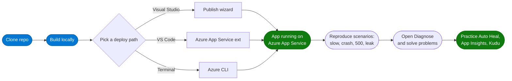
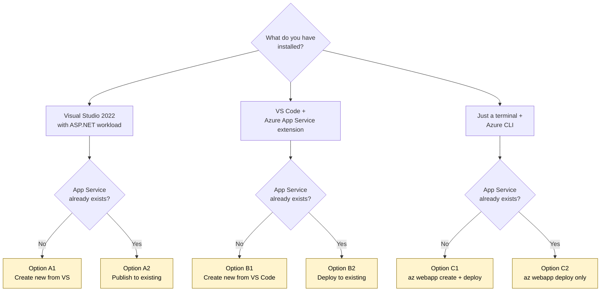

# AppServiceScenarios — Hands-on Lab

> A self-paced lab that takes you from **cloning** a sample ASP.NET application to **deploying** it to **Azure App Service** and **reproducing** real production-style symptoms (slow requests, crashes, high CPU, memory leaks) so you can practice using **Diagnose-and-solve problems**, **Auto Heal**, **Application Insights**, and **Kudu** in a safe environment.

[](https://learn.microsoft.com/aspnet/overview)
[](https://learn.microsoft.com/azure/app-service/)
[](#license)

### Lab at a glance



---

## Table of contents

1. [What you'll build](#1-what-youll-build)
2. [Prerequisites](#2-prerequisites)
3. [Step 1 — Clone the project](#step-1--clone-the-project)
   - [3.1 Clone in Visual Studio Code](#31-clone-in-visual-studio-code)
   - [3.2 Clone in Visual Studio 2022](#32-clone-in-visual-studio-2022)
   - [3.3 Clone from a terminal (any IDE)](#33-clone-from-a-terminal-any-ide)
4. [Step 2 — Build and run locally](#step-2--build-and-run-locally)
5. [Step 3 — Deploy to Azure App Service](#step-3--deploy-to-azure-app-service)
   - [3.A Deploy from **Visual Studio 2022** (Publish wizard)](#3a-deploy-from-visual-studio-2022-publish-wizard)
     - [Option A1: Create a new App Service](#option-a1-create-a-new-app-service)
     - [Option A2: Publish to an existing App Service](#option-a2-publish-to-an-existing-app-service)
   - [3.B Deploy from **VS Code** (Azure App Service extension)](#3b-deploy-from-vs-code-azure-app-service-extension)
     - [Option B1: Create a new App Service](#option-b1-create-a-new-app-service-from-vs-code)
     - [Option B2: Deploy to an existing App Service](#option-b2-deploy-to-an-existing-app-service-from-vs-code)
   - [3.C Deploy from the **Azure CLI** (any OS)](#3c-deploy-from-the-azure-cli-any-os)
6. [Step 4 — Validate the deployment](#step-4--validate-the-deployment)
7. [Step 5 — Run the scenarios](#step-5--run-the-scenarios)
8. [Step 6 — Open Diagnose-and-solve problems](#step-6--open-diagnose-and-solve-problems)
9. [Optional — Enable Application Insights](#optional--enable-application-insights)
10. [Clean up resources](#clean-up-resources)
11. [Troubleshooting](#troubleshooting)
12. [References](#references)
13. [License](#license)

---

## 1. What you'll build

A small **ASP.NET Web Forms** web application that intentionally exposes **8 failure scenarios** so you can practice Azure App Service diagnostics:

| Page / Button | Symptom |
|---|---|
| `Default.aspx` | Tabbed dashboard with 39 click-handlers across 9 tabs |
| `NullRef.aspx` | Throws an unhandled `NullReferenceException` (500 + stack trace) |
| `StackOverflow.aspx?go=1` | Triggers `StackOverflowException` → w3wp crash + restart |
| `Slow10.aspx` | Sleeps 10 seconds — exercises the slow-request detector |
| `Slow60.aspx` | Sleeps 60 seconds — contrasts with default 230 s request timeout |
| `Http500.aspx` | Always returns HTTP 500 — clean Auto-Heal trigger |
| `FastResponse.aspx` | Sub-50 ms baseline for A/B detector noise |
| `HealthCheck.aspx` | Returns 200 by default; `?fail=1` returns 500 for Health-Check tests |

All scenarios run safely — they only affect **your own** App Service instance.

---

## 2. Prerequisites

You only need the prerequisites that match the path you choose (Visual Studio **or** VS Code). The Azure CLI path works on any OS.

### Common to all paths

- An **Azure subscription** — free tier works ([sign up free](https://azure.microsoft.com/free/))
- **Git** for Windows / macOS / Linux — [download](https://git-scm.com/downloads)
- A **GitHub account** (read-only — you can fork later if you want to push changes)

### If you choose Visual Studio (Windows only)

- **Visual Studio 2022** (Community / Professional / Enterprise) version **17.8** or later
- These VS workloads enabled (Visual Studio Installer → Modify):
  - **ASP.NET and web development**
  - **Azure development**
- **.NET Framework 4.8.1 targeting pack** (installed automatically by the ASP.NET workload)

### If you choose VS Code (Windows / macOS / Linux)

- **Visual Studio Code** — [download](https://code.visualstudio.com/)
- These VS Code extensions:
  - **Azure App Service** — `ms-azuretools.vscode-azureappservice`
  - **Azure Account** — `ms-vscode.azure-account`
  - **C# Dev Kit** — `ms-dotnettools.csdevkit` (for IntelliSense, not strictly required for deploy)
- **MSBuild** to compile the .NET Framework project locally:
  - Windows: install **Visual Studio Build Tools 2022** with the "Web development build tools" component
  - macOS / Linux: build is best done on a Windows machine or in a Windows GitHub Actions runner. You can still **deploy** the pre-built `bin\` folder from VS Code on any OS.

### If you choose the Azure CLI

- **Azure CLI** 2.55 or later — [install instructions](https://learn.microsoft.com/cli/azure/install-azure-cli)
- Same MSBuild prerequisites as VS Code if building from source

---

## Step 1 — Clone the project

**Repository URL:** `https://github.com/manju6685/AppServiceScenarios.git`

### 3.1 Clone in Visual Studio Code

1. Open **VS Code**.
2. Press `Ctrl+Shift+P` (Windows / Linux) or `Cmd+Shift+P` (macOS) to open the Command Palette.
3. Type **`Git: Clone`** and press **Enter**.
4. Paste the repository URL:
   ```
   https://github.com/manju6685/AppServiceScenarios.git
   ```
   Press **Enter**.
5. Pick a folder on your machine to clone into (for example `C:\src\` or `~/src/`).
6. When VS Code asks **"Would you like to open the cloned repository?"**, click **Open**.
7. If VS Code asks **"Do you trust the authors of the files in this folder?"**, click **Yes, I trust the authors**.

You now have the project open in VS Code.

### 3.2 Clone in Visual Studio 2022

1. Open **Visual Studio 2022**.
2. On the start window, click **Clone a repository**.
3. In the **Repository location** field, paste:
   ```
   https://github.com/manju6685/AppServiceScenarios.git
   ```
4. Choose a **Path** for the local copy (default is `C:\Users\<you>\source\repos\AppServiceScenarios`).
5. Click **Clone**.
6. After the clone completes, Visual Studio opens **Solution Explorer**. Double-click `AppServiceScenarios.sln` to load the solution.
7. Wait for **NuGet** package restore to finish (status bar shows "Restore completed").

### 3.3 Clone from a terminal (any IDE)

```powershell
cd C:\src     # or ~/src on macOS/Linux
git clone https://github.com/manju6685/AppServiceScenarios.git
cd AppServiceScenarios
```

Open the folder in your editor of choice (`code .` for VS Code, `devenv AppServiceScenarios.sln` for Visual Studio).

---

## Step 2 — Build and run locally

> **Optional but recommended** — confirms the project builds before you deploy.

### In Visual Studio 2022

1. In **Solution Explorer**, right-click the **AppServiceScenarios** project and choose **Set as Startup Project**.
2. Press **F5** (or click the green **▶ IIS Express** button).
3. Visual Studio launches IIS Express and opens `https://localhost:44300/` in your default browser.
4. Click any button on the dashboard to confirm the scenarios work. Press **Shift+F5** to stop.

### In VS Code (Windows only — requires MSBuild)

1. Open the **integrated terminal**: ``Ctrl+` ``.
2. Restore NuGet packages and build:
   ```powershell
   & "C:\Program Files\Microsoft Visual Studio\2022\Professional\MSBuild\Current\Bin\MSBuild.exe" `
       AppServiceScenarios.csproj `
       /t:Restore,Build `
       /p:Configuration=Release
   ```
   (Use **Community** or **BuildTools** instead of **Professional** if that's what you installed.)
3. The compiled output lands in `bin\`. You can launch IIS Express manually:
   ```powershell
   & "C:\Program Files\IIS Express\iisexpress.exe" /path:"$(Resolve-Path .)" /port:8080
   ```
4. Browse to `http://localhost:8080/`.

---

## Step 3 — Deploy to Azure App Service

Pick **one** of the three paths below. All three deploy the same compiled output.

### Which path should I pick?



> **Tip**: Screenshots for the most-used UI steps live in [`docs/images/`](docs/images/). They are referenced inline below — if you see a blank image box, the screenshot has not been captured yet for your environment.

---

### 3.A Deploy from **Visual Studio 2022** (Publish wizard)

#### Option A1: Create a new App Service

Use this option if you **do not** already have an App Service to deploy to.


1. In **Solution Explorer**, right-click the **AppServiceScenarios** project and choose **Publish…**.


2. In the **Publish** wizard, choose **Azure** → **Next**.
3. Choose **Azure App Service (Windows)** → **Next**.
4. If prompted, **sign in** with the same Azure account that owns the subscription you want to use.
5. In the **App Service** dropdown, click the **+ Create new** link (green plus icon) on the right.

   

6. Fill in the **Create App Service** dialog:
   - **Name**: `appsvcscenarios-<your-initials>` (must be globally unique — try adding numbers if it's taken)
   - **Subscription**: pick your subscription
   - **Resource group**: click **New…** → name it `rg-appsvcscenarios-lab`
   - **Hosting Plan**: click **New…**
     - **Name**: `plan-appsvcscenarios-lab`
     - **Location**: `East US 2` (or your nearest region)
     - **Size**: **Free F1** (good enough for the lab) or **Basic B1** (if you want Always On)
7. Click **Create**. Wait ~30 seconds for the resource to be provisioned.
8. Back on the **App Service** step, the new app is now selected. Click **Finish**.
9. The **Publish** summary page opens. Click **Publish** in the top-right.
10. Visual Studio builds the project in **Release** mode, packages it, and uploads it. Watch the **Output** window for `Web App was published successfully`.

    

11. Your default browser opens `https://appsvcscenarios-<your-initials>.azurewebsites.net/`.

#### Option A2: Publish to an existing App Service

Use this option if the App Service was already created (by you, your team, or a prior session).

1. In **Solution Explorer**, right-click **AppServiceScenarios** → **Publish…**.
2. Choose **Azure** → **Next** → **Azure App Service (Windows)** → **Next**.
3. Sign in with the Azure account that has access to that App Service.
4. In the **Subscription** filter, pick the correct subscription.
5. In the **Resource group** filter, pick the resource group that contains the existing app.
6. The **App Service** dropdown shows the existing apps. Click the one you want.
7. Click **Finish**.
8. Click **Publish** on the summary screen.

> **Tip — overwrite vs. side-by-side**: Publish always overwrites the entire `wwwroot`. To preserve the existing app, deploy to a **deployment slot** instead (Publish wizard → Settings tab → Slot dropdown → pick or create a slot like `staging`, then swap from the Portal when ready).

---

### 3.B Deploy from **VS Code** (Azure App Service extension)


#### Option B1: Create a new App Service from VS Code

1. Open the cloned project in VS Code.
2. **Build the project** first (VS Code's App Service extension deploys files; it does not invoke MSBuild for Web Forms). In the integrated terminal:
   ```powershell
   & "C:\Program Files\Microsoft Visual Studio\2022\Professional\MSBuild\Current\Bin\MSBuild.exe" `
       AppServiceScenarios.csproj `
       /t:Restore,Build `
       /p:Configuration=Release `
       /p:DeployOnBuild=true `
       /p:WebPublishMethod=Package `
       /p:PackageAsSingleFile=false `
       /p:PackageLocation=".\obj\Release\Package"
   ```
   The deployable files are now in `obj\Release\Package\PackageTmp\`.
3. Open the **Azure** view (Azure icon in the Activity Bar).
4. If you're not signed in, click **Sign in to Azure…** and complete the browser sign-in.
5. Expand your subscription.
6. Right-click **App Services** → **Create New Web App… (Advanced)**.
7. Follow the prompts:
   - **Name**: `appsvcscenarios-<your-initials>` (globally unique)
   - **Resource Group**: **Create new** → `rg-appsvcscenarios-lab`
   - **Runtime stack**: **ASP.NET V4.8** (Windows is selected automatically)
   - **OS**: **Windows**
   - **Location**: nearest region
   - **App Service Plan**: **Create new** → `plan-appsvcscenarios-lab`
   - **Pricing Tier**: **F1 Free** or **B1 Basic**
   - **Application Insights**: **Skip for now** (you can add it later)
8. Wait for the App Service to be created (~30 s). VS Code shows a notification when it's done.
9. **Deploy the build output**:
   - In the Azure view, right-click your new App Service → **Deploy to Web App…**
   - When VS Code asks for the folder, pick **`obj\Release\Package\PackageTmp`** (NOT the project root).
   - VS Code zips the folder and uploads it via Kudu **ZipDeploy**.
10. When the deploy notification appears with **Browse Website**, click it.

#### Option B2: Deploy to an existing App Service from VS Code

1. Build the project (same MSBuild command as B1 step 2).
2. Open the **Azure** view, sign in if needed, and expand the subscription containing your app.
3. Find the existing app under **App Services**. Right-click it → **Deploy to Web App…**.
4. Pick the **`obj\Release\Package\PackageTmp`** folder when prompted.
5. VS Code warns "Are you sure you want to deploy to <app>? This will overwrite any previous deployment." Click **Deploy**.
6. Wait for the upload to finish; click **Browse Website** when prompted.

> **Tip — deploy slots from VS Code**: expand the App Service → **Deployment Slots** node → right-click a slot → **Deploy to Slot…**. Same flow, but the target is the slot URL `https://<app>-<slot>.azurewebsites.net/`.

---

### 3.C Deploy from the **Azure CLI** (any OS)

Use this if you prefer scripting or are deploying from a CI/CD pipeline.

1. Build the project (Windows with MSBuild — see VS Code B1 step 2 above), so files are in `obj\Release\Package\PackageTmp\`.
2. Create a deployment zip:
   ```powershell
   Compress-Archive -Path .\obj\Release\Package\PackageTmp\* -DestinationPath .\deploy.zip -Force
   ```
3. Sign in:
   ```powershell
   az login
   az account set --subscription "<your-subscription-id>"
   ```
4. **Option C1 — Create new App Service**:
   ```powershell
   $rg   = "rg-appsvcscenarios-lab"
   $loc  = "westus2"
   $plan = "plan-appsvcscenarios-lab"
   $app  = "appsvcscenarios-<your-initials>"

   az group create -n $rg -l $loc
   az appservice plan create -g $rg -n $plan --sku B1 --location $loc
   az webapp create -g $rg -p $plan -n $app --runtime "ASPNET:V4.8"
   az webapp deploy -g $rg -n $app --src-path .\deploy.zip --type zip
   ```
5. **Option C2 — Deploy to an existing App Service**:
   ```powershell
   az webapp deploy -g <existing-rg> -n <existing-app> --src-path .\deploy.zip --type zip
   ```
6. Open the site:
   ```powershell
   Start-Process "https://$app.azurewebsites.net/"
   ```

---

## Step 4 — Validate the deployment

After deployment, browse to `https://<your-app>.azurewebsites.net/` and confirm:

| Check | URL | Expected |
|---|---|---|
| Default dashboard loads | `/Default.aspx` | HTTP 200, tabbed dashboard renders |
| Health check returns 200 | `/HealthCheck.aspx` | HTTP 200 |
| Fast baseline works | `/FastResponse.aspx` | HTTP 200, sub-50 ms response |

You can also confirm via the Azure Portal:
- **App Service → Overview** — status should be **Running**.
- **App Service → Metrics** — pick **Http 2xx** to confirm successful requests.

---

## Step 5 — Run the scenarios

Once the site is live, use the dashboard or hit the pages directly to reproduce each symptom:

```text
https://<your-app>.azurewebsites.net/NullRef.aspx          → unhandled NullReferenceException (500)
https://<your-app>.azurewebsites.net/StackOverflow.aspx?go=1 → process crash (w3wp recycles)
https://<your-app>.azurewebsites.net/Slow10.aspx           → 10-second request
https://<your-app>.azurewebsites.net/Slow60.aspx           → 60-second request
https://<your-app>.azurewebsites.net/Http500.aspx          → always-500 (Auto-Heal trigger)
https://<your-app>.azurewebsites.net/HealthCheck.aspx?fail=1 → Health-Check fail mode
```

Or open `Default.aspx` and click any button in the **Critical Tests**, **Delays**, **HTTP 4xx**, or **HTTP 5xx** tabs.

> **YSOD note:** the project ships with `<customErrors mode="Off"/>` in `Web.config` so you see the full stack trace in the browser. For production, change to `RemoteOnly` or `On`.

---

## Step 6 — Open Diagnose-and-solve problems

This is where the lab pays off — every scenario you ran in **Step 5** is detected by the platform.


1. In the **Azure Portal**, open your App Service.
2. In the left menu, click **Diagnose and solve problems**.
3. Click **Availability and Performance**.
4. Open these detectors and observe what was captured:
   - **Web App Down** — should be green if you avoided StackOverflow
   - **HTTP Server Errors** — your `Http500` and `NullRef` hits appear here
   - **Slow Web App** — your `Slow10` / `Slow60` hits appear here
   - **High CPU** — only if you ran the `HighCPU` button on the dashboard
   - **Memory** — only if you ran the `Memory` button
5. Try the **Diagnostic Tools** tile too:
   - **Auto Heal** — configure a rule: HTTP 500 count > 5 in 5 min → Recycle Process
   - **Proactive CPU Monitoring** — configure a 80 % / 60 s threshold and a storage container for the dump
   - **Memory Dump Collector** — on-demand dump capture
   - **Network Trace** — on-demand 60-second pcap

---

## Optional — Enable Application Insights

Application Insights gives you code-level telemetry (requests, dependencies, exceptions, live metrics).

1. In the Azure Portal, open your App Service → **Application Insights** (left menu).
2. Click **Turn on Application Insights** → **Create new resource** → accept defaults → **Apply**.
3. App Service restarts the worker. Wait ~30 seconds.
4. Click a few buttons on the dashboard again.
5. Back in the Portal, open **Application Insights → Live Metrics**. You should see requests and exceptions appear in real time.
6. Open **Application Insights → Failures**. Click any exception to see the full end-to-end transaction.

---

## Clean up resources

When you're done with the lab, delete the **resource group** to remove the App Service, App Service Plan, and any storage/Application Insights resources you created.

**Azure Portal:**
1. **Resource groups** → find `rg-appsvcscenarios-lab` → **Delete resource group** → type the name to confirm.

**Azure CLI:**
```powershell
az group delete -n rg-appsvcscenarios-lab --yes --no-wait
```

> If you deployed to an **existing** App Service, do **not** delete its resource group. Instead delete just the deployment files via Kudu → Debug Console → `cd site\wwwroot` → `rm -r *`.

---

## Troubleshooting

| Symptom | Cause | Fix |
|---|---|---|
| `403` on deploy from VS Code or VS | Basic auth disabled on App Service | Portal → App Service → Configuration → **General settings** → **SCM Basic Auth Publishing Credentials** → **On**, or use **Microsoft Entra** sign-in (VS 17.10+) |
| Deploy succeeds but site shows "Your App Service app is up and running" placeholder | App was deployed empty (wrong folder) | Re-deploy and select **`obj\Release\Package\PackageTmp`**, not the project root |
| `HTTP 500.30 - ANCM In-Process Start Failure` | Wrong runtime stack on App Service | Portal → Configuration → **General settings** → **Stack** = **.NET** → **Version** = **.NET Framework 4.8** |
| Cannot connect to GitHub via `git clone` | Corporate proxy | Set `git config --global http.proxy http://proxy:port` or download the ZIP from the GitHub Code → Download ZIP button and extract |
| MSBuild not found in VS Code terminal | Visual Studio Build Tools not installed | Install **Build Tools for Visual Studio 2022** with the "Web development build tools" component |
| `customErrors` page replaces the YSOD | App was overridden by a transformed Web.config | Confirm `Web.config` still has `<customErrors mode="Off"/>` after deploy; or set `ASPNETCORE_DETAILEDERRORS=true` in **Configuration → Application settings** |
| Diagnose-and-solve shows nothing | Less than ~10 minutes since the symptom | Detectors poll every 5–10 min; wait and refresh |

---

## References

### Official Microsoft Learn docs
- [Azure App Service overview](https://learn.microsoft.com/azure/app-service/overview)
- [Deploy your app to Azure App Service](https://learn.microsoft.com/azure/app-service/deploy-best-practices)
- [Deploy from Visual Studio to App Service](https://learn.microsoft.com/visualstudio/deployment/quickstart-deploy-aspnet-web-app)
- [Deploy from VS Code to App Service](https://learn.microsoft.com/azure/app-service/quickstart-dotnetcore?tabs=net80&pivots=development-environment-vscode)
- [Azure CLI — `az webapp deploy`](https://learn.microsoft.com/cli/azure/webapp#az-webapp-deploy)
- [Run from Package (recommended)](https://learn.microsoft.com/azure/app-service/deploy-run-package)
- [App Service Diagnostics — Diagnose and solve problems](https://learn.microsoft.com/azure/app-service/overview-diagnostics)
- [Auto Heal](https://learn.microsoft.com/azure/app-service/overview-diagnostics#auto-heal)
- [Health Check](https://learn.microsoft.com/azure/app-service/monitor-instances-health-check)
- [Kudu overview](https://learn.microsoft.com/azure/app-service/resources-kudu)
- [Application Insights for App Service](https://learn.microsoft.com/azure/azure-monitor/app/azure-web-apps)

### Microsoft Learn modules and tutorials
- [Module: Host a web app with Azure App Service](https://learn.microsoft.com/training/modules/host-a-web-app-with-azure-app-service/)
- [Module: Stage a web app deployment for testing](https://learn.microsoft.com/training/modules/stage-deploy-app-service-deployment-slots/)
- [Tutorial: Highly available multi-region app in App Service](https://learn.microsoft.com/azure/app-service/tutorial-multi-region-app)
- [Tutorial: Isolate backend with VNet integration](https://learn.microsoft.com/azure/app-service/tutorial-networking-isolate-vnet)

### Team blog (deeper dives)
- [Azure App Service team blog](https://azure.github.io/AppService/)
- [Robust Apps for the Cloud — best-practice checklist](https://azure.github.io/AppService/2020/05/15/Robust-Apps-for-the-cloud.html)
- [Resiliency Score Report announcement](https://azure.github.io/AppService/2024/03/05/Resiliency-Score-Report.html)

---

## License

MIT — see [LICENSE](LICENSE) if present, or use this project for any educational / customer-training purpose.

---

> **Maintainer**: this repository is provided as a teaching aid. If you spot something out of date, please open an issue on the GitHub repo.
